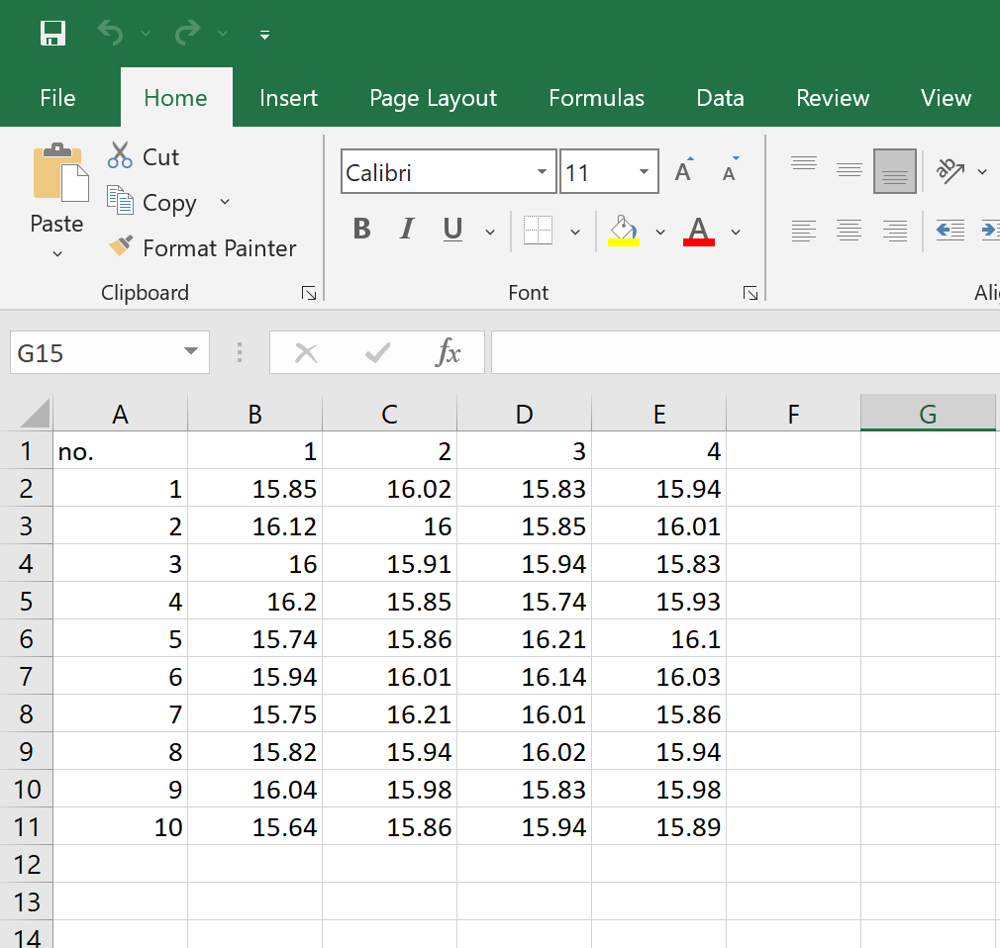
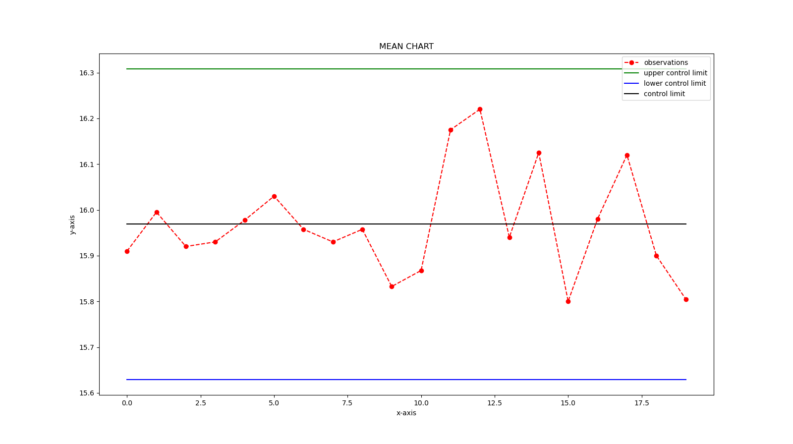
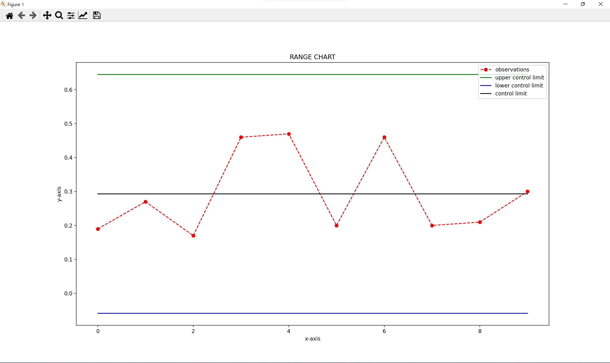

<h1 align="center">📈 Statistical Quality Control 📉</h1>

This repo contains a simple but effective tool made using python which can be used for quality control in statistical approach.

# What is Statistical Quality Control?
- ### statistical quality control is the use of statistical methods in the monitoring and maintaining of the quality of products and services. One method, referred to as acceptance sampling, can be used when a decision must be made to accept or reject a group of parts or items based on the quality found in a sample
- ### Statistical quality control can be simply defined as an economic & effective system of maintaining & improving the quality of outputs throughout the whole operating process of specification, production & inspection based on continuous testing with random samples.

# Why Statistical Quality Control?, what makes it important?
- ### Statistical quality control techniques are extremely important for operating the estimable variations embedded in almost all manufacturing processes. Such variations arise due to raw material, consistency of product elements, processing machines, techniques deployed and packaging applications
- ### SQC serves as a medium allowing manufacturers to attain maximum benefits by following controlled testing of manufactured products. Using this procedure, a manufacturing team can investigate the range of products with certain values that can be expected to reside under some existing conditions.

# This statistical Quality Control can be easily implemented in python in few lines of code and graph can be beautifully visualized and analysed using matplotlib library.

## For example lets consider a real life problem statement given like this:
- #### A quality control inspector at the Cocoa Fizz soft drink company has taken ten samples with four observations each of the volume of bottles filled. The data and the computed means are shown in the table, use this information to develop control limits of three standard deviations for the bottling operation.
## Data can be taken taken into an excel sheet like this:
<p align='center'></p>

#### After appending the data into excel sheet just hit run, statistical calculation will be done and you're greeted with this two graphs one is X-chat and the other one is R-chart.The x-bar and R-chart are quality control charts used to monitor the mean and variation of a process based on samples taken in a given time.X-bar chart: The mean or average change in process over time from subgroup values. The control limits on the X-Bar brings the sample’s mean and center into consideration.R-chart: The range of the process over the time from subgroups values. This monitors the spread of the process over the time.

## Depending upon Data Graphs look like this:
<p align='center'>(x-bar control chart)</p>
<p align='center'>(r-bar control chart)</p>

From the both X bar and R charts it is clearly evident that the process is almost stable. If by chance the process is unstable that is there are many point in the outer region of quality control you make the process stable by changing the control limits,After the process stabilized, still if any point going out of control limits, it indicates an assignable cause exists in the process that needs to be addressed. This is an ongoing process to monitor the process performance.
### Note:
- Update data in excel before running the script, any number of rown and coloumns can be given.
- Import used in this project are:
```python
import pandas as pd 
import statistics
from statistics import mean,pstdev
import matplotlib.pyplot as plt
import numpy as np
```
make sure to install them before hand.
- Code and logic is xplained in jupyter note book , do check that out
- If you're interested more on this topic u can refer this <a href='https://ncss-wpengine.netdna-ssl.com/wp-content/themes/ncss/pdf/Procedures/NCSS/X-bar_and_R_Charts.pdf'>PDF</a>

# Peace ✌️. 
